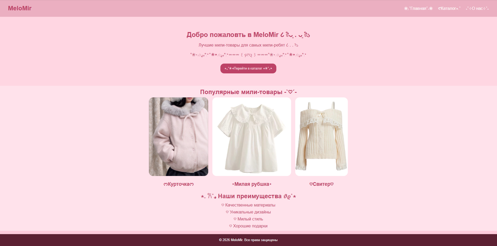
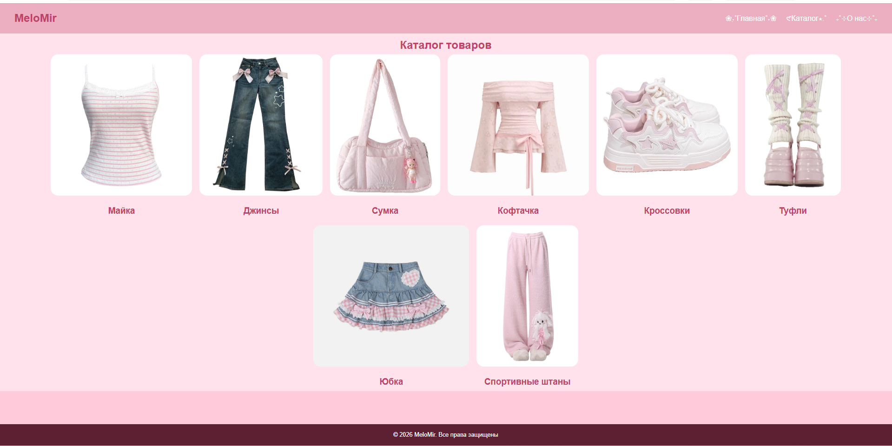
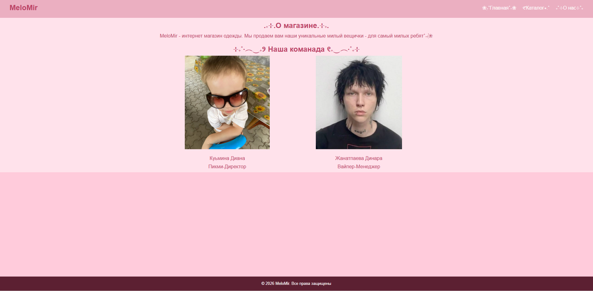

## Лабораторная работа №14-16 - Интернет-магазин "MeloMir"
### ФИО: Кузьмина Диана Александровна
### Группа: ИСП-232
### Дата: 28.02.2026
___
##### ***Описание проекта:***
Потрясающий сайт с милой, крутой, классной, хайповой, имбовой одеждой для пикми.

***Реализованные страницы***
- Главная — приветственный баннер, популярные товары, преимущества
- Каталог — сетка из 8 карточек товаров с одеждой
- О нас — информация о магазине и команде

___

***Реализованные функции***
- Адаптивное навигационное меню
- Карточки товаров с hover-эффектами
- CSS Grid для каталога (3 колонки)
- Flexbox для навигации и футера
- Адаптивная вёрстка (desktop/tablet/mobile)
- Единая цветовая схема и типографика

***Технологии***
- HTML5
- CSS3 (Flexbox, Grid, Media Queries)
- Git/GitHub

***Скриншоты***
- Главная страница
 
- Каталог товаров

- О нас

